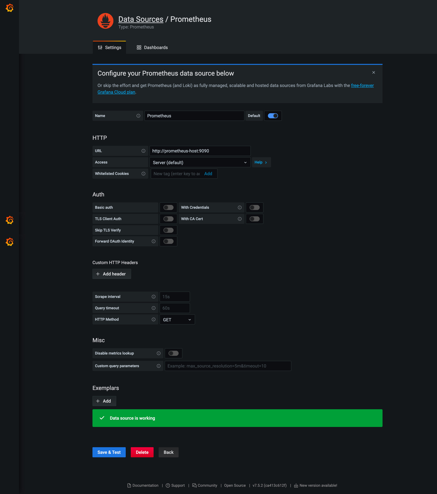

## Metrics configuration and how to import metrics of [Prebid server](https://docs.prebid.org/prebid-server/versions/pbs-versions-go.html) to [Grafana](https://grafana.com/) through [Prometheus](https://prometheus.io/) stack.
     
#### These are the parameters that are capable for metrics collection 

- PBS_METRICS_PROMETHEUS_PORT=9100 - default is 0.

If PBS_METRICS_PROMETHEUS_PORT is null, your [Prebid server](https://docs.prebid.org/prebid-server/versions/pbs-versions-go.html) won't collect any metrics.
  
- PBS_METRICS_PROMETHEUS_NAMESPACE=prebid - default is empty.
  
PBS_METRICS_PROMETHEUS_NAMESPACE - this is responsable for the primary prefix added to your metrics to ensure uniqueness within your cluster.
  
- PBS_METRICS_PROMETHEUS_SUBSYSTEM=server - default is empty.

PBS_METRICS_PROMETHEUS_SUBSYSTEM - this is a secondary prefix added to metrics to ensure uniqueness.
  
- PBS_METRICS_DISABLED_METRICS_ADAPTER_CONNECTIONS_METRICS=false - default is true.

PBS_METRICS_DISABLED_METRICS_ADAPTER_CONNECTIONS_METRICS - If this flag is set to true you won't get any bidder http connection adapter metrics (e.g. number of new vs reused connections) but you'll still get other adapter metrics.

#### If you're going to get metrics though [Prometheus](https://prometheus.io/) and [Prometheus](https://prometheus.io/) stack has been already installed, you have several options, please chose one:

- change environments into code (bad way).
 
- create pbs.yaml if it hasn't been already created (It works, but not flexible).

- input the parameters into global environments (Highly recommend you to use this way also it's reliable).

#### Finally, when you fill in your credentials of metrics, please, run:

 - build your app 
```bash
go build .
```
 - run the server
```bash
./prebid-server
```

#### Make sure that an application returns any metrics - `http://localhost:9100/`, if not, please check your names of environment and recompile again.

#### Add your host and port into prometheus.yml file on the instance of your [Prometheus](https://prometheus.io/).

```yaml
global:
  scrape_interval: 15s
  evaluation_interval: 15s

  external_labels:
    monitor: 'docker-host-alpha'

rule_files:
  - "alert.rules"

scrape_configs:
  - job_name: 'prometheus'
    scrape_interval: 10s
    static_configs:
      - targets: [ 'prometheus-host:9090']

  - job_name: 'prebidserver-metrics'
    scrape_interval: 10s
    static_configs:
      - targets: ['prebidserver-host:9100' ]
alerting:
  alertmanagers:
    - scheme: http
      static_configs:
        - targets:
            - 'localhost:9093'
```

#### Import data source as [Prometheus](https://prometheus.io/) into [Grafana](https://grafana.com/)

Just fill in host and port of [Prometheus](https://prometheus.io/)



#### In that case [Prebid server](https://docs.prebid.org/prebid-server/versions/pbs-versions-go.html) uses [package](https://github.com/prometheus/client_golang) in our case it works as [Node exporter](https://github.com/prometheus/node_exporter). Therefore, here is described only how to connect [Prebid server](https://docs.prebid.org/prebid-server/versions/pbs-versions-go.html) connection with [Prometheus](https://prometheus.io/). Also, if you are interested in [Prometheus](https://prometheus.io/) and want to dig deep, follow [docs](https://prometheus.io/docs/introduction/overview/).
